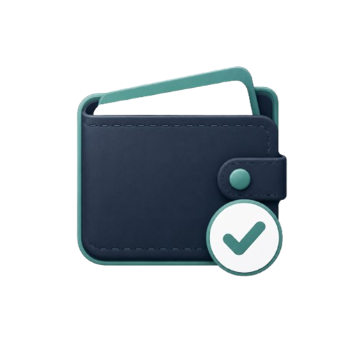
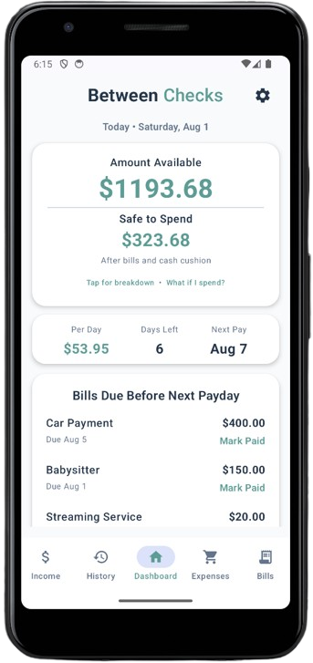
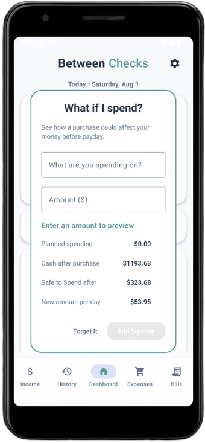
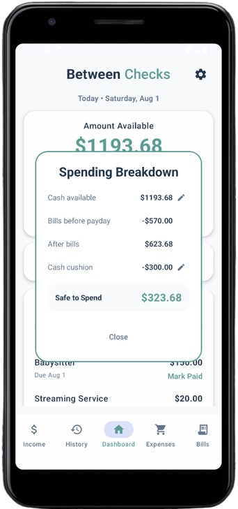
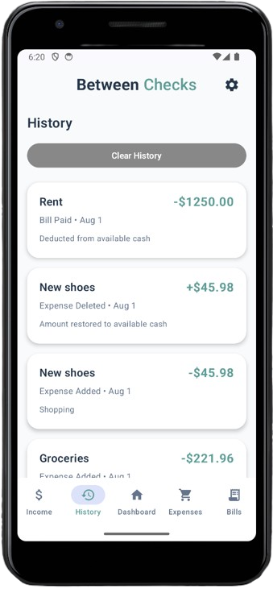
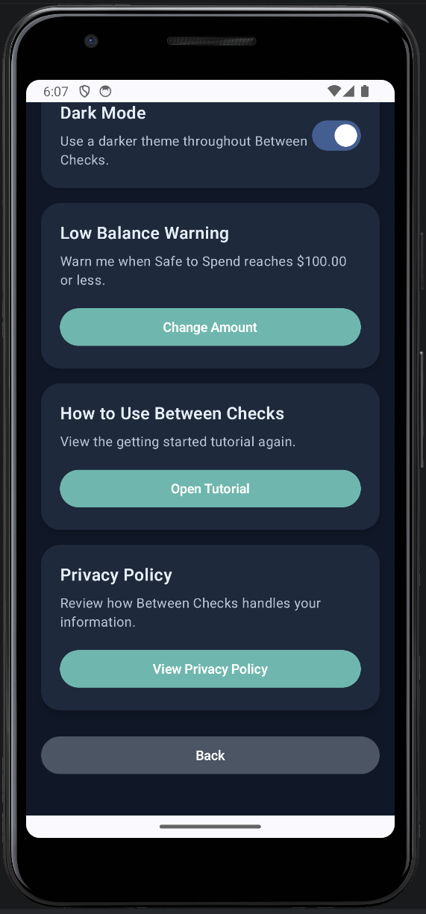

# Between Checks

  

**Between Checks** is a privacy-first Android budgeting app built to answer one practical question:

> **How much can I safely spend until my next paycheck?**

The app is designed for people who manage money one pay period at a time and want a clear, low-friction view of what is available after upcoming bills and recent spending.

Instead of requiring bank connections, account creation, or a complex long-term budget, Between Checks keeps the experience focused on the current pay period.

---

## Project Status

Between Checks is currently being prepared for release under its new name and branding.

The app was previously developed and released as **SpendGuard**. The project has since been renamed and repositioned to better reflect its paycheck-to-paycheck focus.

Current work includes:

- Completing the Between Checks rebrand
- Updating screenshots and project documentation
- Refining the dashboard and spending breakdown experience
- Expanding the **What If I Spend?** feature
- Preparing the next Google Play release

---

## Core Purpose

Between Checks helps users understand their money between one paycheck and the next.

The app combines current cash, expected income, upcoming bills, and recorded expenses to provide a simple view of:

- Money currently available
- Bills due before the next paycheck
- Estimated money available per day
- Recent spending activity
- The effect of a possible purchase before it is made

The goal is not to replace a full financial planning platform. It is to help users make clearer short-term decisions with the money they have right now.

---

## Features

- Track current cash available
- Add multiple income sources
- Set a primary income source
- Support weekly, biweekly, monthly, and one-time income
- Add recurring and one-time bills
- See which bills are due before the next paycheck
- Mark bills as paid
- Record expenses
- Review spending history
- View spending by category
- See available money per day
- Test a possible purchase with **What If I Spend?**
- Edit or delete income sources and bills
- Update available cash quickly
- Light and dark mode support
- Getting started tutorial
- Privacy policy access from Settings
- App version display
- Local storage with no account required
- No bank connection required

---

## Main Screens

### Dashboard

The dashboard gives users an immediate view of their current pay period, including available money, days remaining, next payday, daily spending guidance, and upcoming bills.

### Income

Users can add, edit, delete, and manage income sources. One income source can be selected as the primary paycheck used for pay-period calculations.

### Bills

Users can manage recurring and one-time bills, review what is due before the next paycheck, and mark bills as paid.

### Spending Breakdown

The spending breakdown groups recorded expenses so users can better understand where their money is going during the current period.

### History

The history screen provides a record of spending and budget activity for review.

### What If I Spend?

This feature lets users enter a possible purchase and preview how it would affect the money available until the next paycheck.

### Settings

Settings provides access to appearance preferences, tutorials, privacy information, purchase restoration, app details, and other app options.

---

## Screenshots

<table>
  <tr>
    <td align="center">
      <strong>Dashboard</strong> 
      
    </td>
    <td align="center">
      <strong>What If I Spend?</strong> 
      
    </td>
    <td align="center">
      <strong>Spending Breakdown</strong> 
      
    </td>
  </tr>
  <tr>
    <td align="center">
      <strong>History</strong> 
      
    </td>
    <td align="center">
      <strong>Settings</strong> 
      
    </td>
  </tr>
</table>

---

## Privacy

Between Checks is designed around local-first budgeting.

- No account or login is required
- No bank connection is required
- Income, bills, expenses, dates, history, and cash available are stored locally on the user's device
- The app does not request banking usernames, passwords, account numbers, or card numbers

The app may display banner ads through Google AdMob. Manually entered budgeting information is not shared with advertisers by Between Checks.

Privacy Policy:  
https://sites.google.com/view/trs-safespend-privacy-policy

---

## Built With

- Kotlin
- Jetpack Compose
- Android Studio
- Room Database
- Google AdMob
- Google Play Billing
- Google Play Console

---

## Design Goals

Between Checks was built around the following principles:

- **Simple:** Useful information should be visible without navigating through complicated reports
- **Focused:** The app centers on the time between the current day and the next paycheck
- **Private:** Financial data stays on the device and no account is required
- **Practical:** The app supports real decisions users make during a pay period
- **Readable:** The interface is designed for quick scanning in both light and dark mode
- **Low setup:** Users can begin with their current cash, next paycheck, bills, and expenses

---

## Monetization

The project includes support for Google AdMob banner ads and Google Play Billing.

A planned one-time purchase will allow users to remove ads permanently for the purchasing Google account.

Planned product:

- **Remove Ads**
  - Product ID: `remove_ads`
  - Type: One-time purchase
  - Purpose: Permanently removes banner ads

---

## Testing

The project has been tested across the major budgeting and release flows, including:

- Fresh install behavior
- Local data persistence
- Income add, edit, and delete flows
- Bill add, edit, and delete flows
- Expense tracking
- Spending history
- One-time and recurring bills
- Paid and overdue bill behavior
- Dashboard calculations
- Date edge cases
- Light and dark mode
- Settings and tutorial access
- Privacy policy access
- App version display
- Physical device testing
- AdMob integration
- Google Play Billing setup
- Restore Purchases behavior
- Phone and tablet layouts

---

## Development Background

Between Checks began as a simple Android budgeting prototype and grew through multiple rounds of feature development, usability improvements, testing, release preparation, and rebranding.

The project demonstrates:

- Android application development with Kotlin and Jetpack Compose
- Local data modeling with Room
- Pay-period-based calculation logic
- Recurring and one-time financial entries
- Expense history and category breakdowns
- Responsive light and dark mode interfaces
- Google Play release preparation
- AdMob and Google Play Billing integration
- Iterative product design based on a defined user problem

---

## Developer

Created by **July Wellman**  
**Tiny Rebellion Studios**
